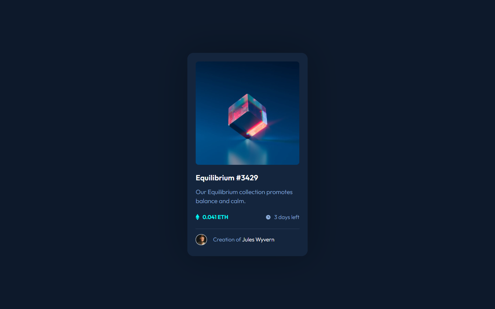
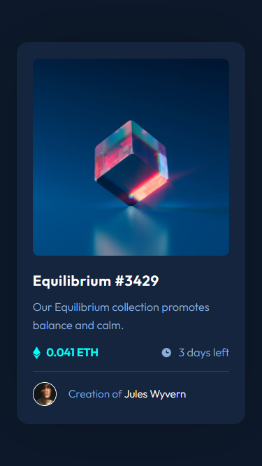

# Frontend Mentor - NFT preview card component solution

This is a solution to the [NFT preview card component challenge on Frontend Mentor](https://www.frontendmentor.io/challenges/nft-preview-card-component-SbdUL_w0U). Frontend Mentor challenges help you improve your coding skills by building realistic projects.

## Table of contents

- [Overview](#overview)
  - [The challenge](#the-challenge)
  - [Screenshot](#screenshot)
  - [Links](#links)
- [My process](#my-process)
  - [Built with](#built-with)
  - [What I learned](#what-i-learned)
  - [Continued development](#continued-development)
  - [Useful resources](#useful-resources)
- [Author](#author)
- [Acknowledgments](#acknowledgments)

**Note: Delete this note and update the table of contents based on what sections you keep.**

## Overview

### The challenge

Users should be able to:

- View the optimal layout depending on their device's screen size
- See hover states for interactive elements

### Screenshot

Taken with [FireShot](https://getfireshot.com/)

### Links

- Solution URL: [Solution repo](https://github.com/kemenyfa-szu/frontendmentor-005-nft-preview)
- Live Site URL: [Live Site](https://kemenyfa-szu.github.io/frontend-mentor/005-nft-preview/)

## My process

### Built with

- Semantic HTML5 markup
- SASS (scss)
- Flexbox

### What I learned

- Basics of SASS preprocessor

### Useful resources

- [Youtube - Kevin Powell](https://www.youtube.com/@KevinPowell) - This channel helped me understanding the basics of SASS.
- [Youtube - Traversy Media - SASS Crash course](https://www.youtube.com/watch?v=nu5mdN2JIwM) - A very useful SASS crash course video

## Author

- Website - [kemenyfa-szu.github.io](https://kemenyfa-szu.github.io/)
- Frontend Mentor - [@kemenyfa-szu](https://www.frontendmentor.io/profile/kemenyfa-szu)
