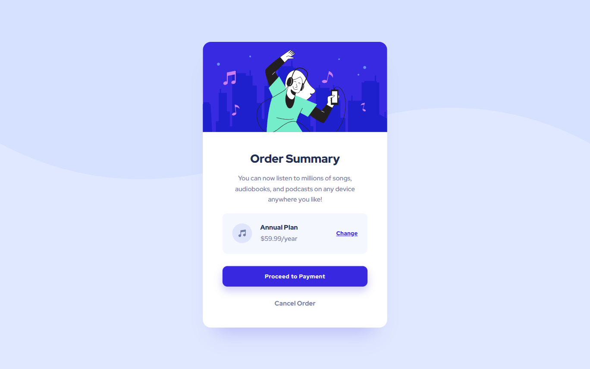

# Frontend Mentor - Order summary card solution

This is a solution to the [Order summary card challenge on Frontend Mentor](https://www.frontendmentor.io/challenges/order-summary-component-QlPmajDUj). Frontend Mentor challenges help you improve your coding skills by building realistic projects.

## Table of contents

- [Overview](#overview)
  - [The challenge](#the-challenge)
  - [Screenshot](#screenshot)
  - [Links](#links)
- [My process](#my-process)
  - [Built with](#built-with)
  - [What I learned](#what-i-learned)
- [Author](#author)
- [Acknowledgments](#acknowledgments)

## Overview

### The challenge

Users should be able to:

- See hover states for interactive elements

### Screenshot

Taken with [FireShot](https://getfireshot.com/)

### Links

- Solution URL: [Solution](https://github.com/kemenyfa-szu/frontendmentor-006-order-summary)
- Live Site URL: [Live Site](https://kemenyfa-szu.github.io/frontend-mentor/006-order-summary)

## My process

### Built with

- Semantic HTML5 markup
- SASS
- Flexbox

### What I learned

- Manipulating background images
- Learned the hard way to always start sass compiler when you continue coding :D

## Author

- Website - [My Github Page](https://kemenyfa-szu.github.io)
- Frontend Mentor - [@kemenyfa-szu](https://www.frontendmentor.io/profile/kemenyfa-szu)

## Acknowledgments

- [ChatGPT](https://chat.openai.com/chat) Helped me a lot in pointing out my mistakes when I did not find the cause why my page did not render as expected. Also gave me good perspectives on how to reach a wanted result.
