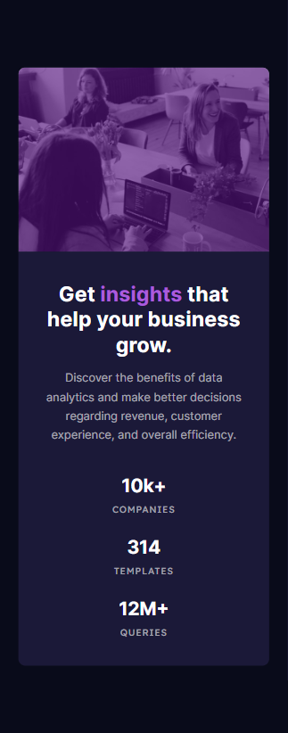

# Frontend Mentor - Stats preview card component solution

This is a solution to the [Stats preview card component challenge on Frontend Mentor](https://www.frontendmentor.io/challenges/stats-preview-card-component-8JqbgoU62). Frontend Mentor challenges help you improve your coding skills by building realistic projects.

## Table of contents

- [Overview](#overview)
  - [The challenge](#the-challenge)
  - [Screenshot](#screenshot)
  - [Links](#links)
- [My process](#my-process)
  - [Built with](#built-with)
  - [What I learned](#what-i-learned)
  - [Continued development](#continued-development)
  - [Useful resources](#useful-resources)
- [Author](#author)

## Overview

### The challenge

Users should be able to:

- View the optimal layout depending on their device's screen size

### Screenshot

Taken with [FireShot](https://getfireshot.com/)

### Links

- Solution URL: [Solution repo](https://github.com/kemenyfa-szu/frontendmentor-007-stats-preview-card)
- Live Site URL: [Live Site](https://kemenyfa-szu.github.io/frontend-mentor/007-stats-preview-card)

## My process

### Built with

- Semantic HTML5 markup
- SASS
- Flexbox

## Author

- Website - [Github page](https://kemenyfa-szu.github.io)
- Frontend Mentor - [@kemenyfa-szu](https://www.frontendmentor.io/profile/kemenyfa-szu)
